# Big Data Analytics Lab – Week 14 (PySpark)

**St: Olga Durham** \
**St#: 040687883**

---

## Overview

This project demonstrates big data analytics using **PySpark** on a simulated retail transactions dataset.  
The lab covers the full analytics pipeline, including:

- Data preprocessing and feature engineering
- Descriptive analytics
- Diagnostic analytics
- Advanced analytics using window functions
- Predictive-style analysis (RFM scoring)
- Customer segmentation
- Anomaly detection
- Data export

---

## Dataset

The dataset is a **simulated retail transaction dataset** provided in the lab, containing:

- Customer information
- Product category
- Region
- Transaction timestamp
- Payment method
- Price and quantity

---

## Technologies Used

- Python 3.11
- PySpark
- Pandas
- Git & GitHub

---

## Data Preparation

### Figure 1 – Initial Schema

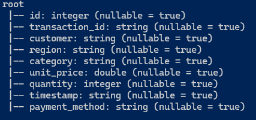

### Figure 2 – Sample Data (First 5 Rows)

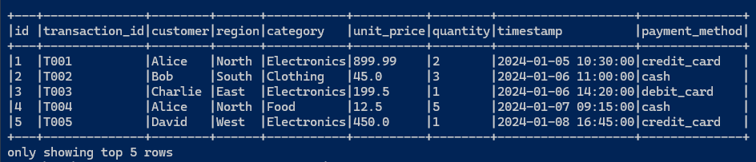

### Figure 3 – Timestamp Conversion

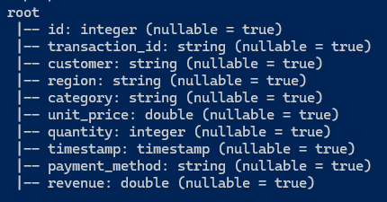

### Figure 4 – Revenue Column Added

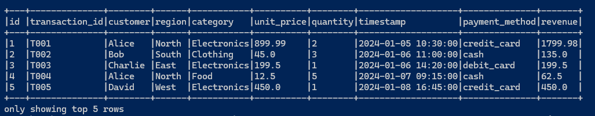

---

## Descriptive Analytics

### Figure 5 – Summary Statistics

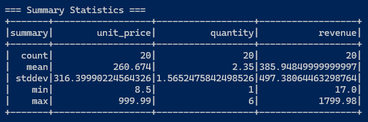

### Figure 6 – Revenue by Category

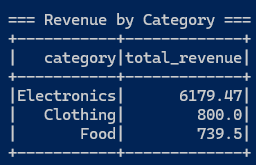

### Figure 7 – Revenue by Region

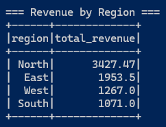

---

## Diagnostic Analytics

### Figure 8 – Revenue by Region and Category

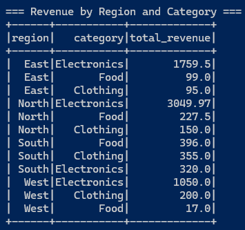

### Figure 9 – Revenue by Payment Method and Category (Pivot Table)

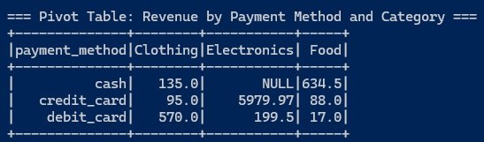

### Figure 10 – Monthly Revenue Trends

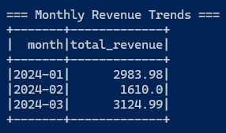

---

## Advanced Analytics (Window Functions)

### Figure 11 – Customer Revenue Ranking

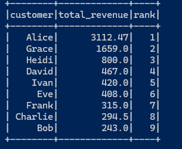

### Figure 12 – Running Revenue by Region Over Time

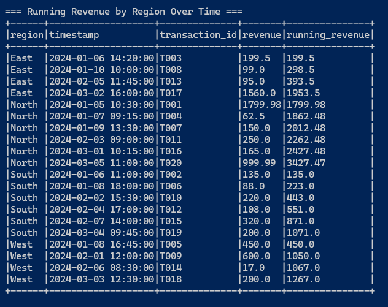

### Figure 13 – Revenue Quartiles

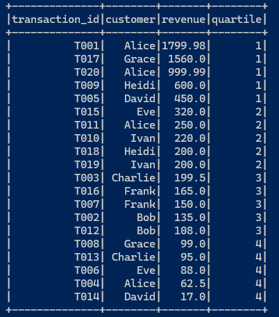

---

## Predictive Analytics (RFM Model)

### Figure 14 – RFM Scoring

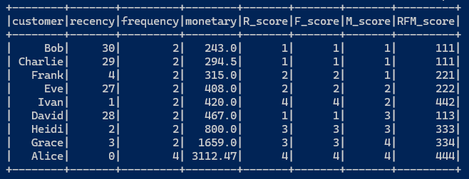

---

## Customer Segmentation

### Figure 15 – Customer Segmentation Results

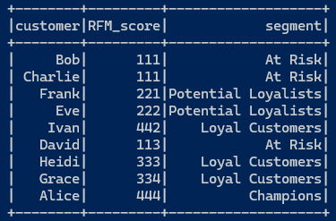

Segments identified:

- Champions
- Loyal Customers
- Potential Loyalists
- At Risk

---

## Anomaly Detection

### Figure 16 – Z-Score Based Anomaly Detection

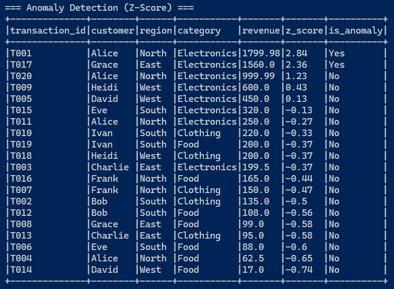

High-value transactions were identified as anomalies using statistical deviation.

---

## Data Export

### Figure 17 – Final Data Export

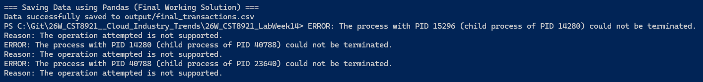

Due to Windows environment limitations related to Hadoop dependencies,  
the Spark DataFrame was converted to a Pandas DataFrame and exported as CSV:

```
output/final_transactions.csv
```

---

## Key Insights

- `Electronics` category generates the highest revenue
- `North` region performs best overall
- `credit_card` is the dominant payment method for high-value purchases
- `Alice` is the top customer (Champion segment)
- High-value transactions were successfully identified as anomalies

---

## Conclusion

This lab demonstrates how PySpark can be used to perform end-to-end big data analytics, from data preparation to advanced insights and business-driven segmentation.

---

## Repository Structure

```
├── big_data_analytics_lab.py
├── screenshots/
├── output/
│ └── final_transactions.csv
├── README.md
```

---
